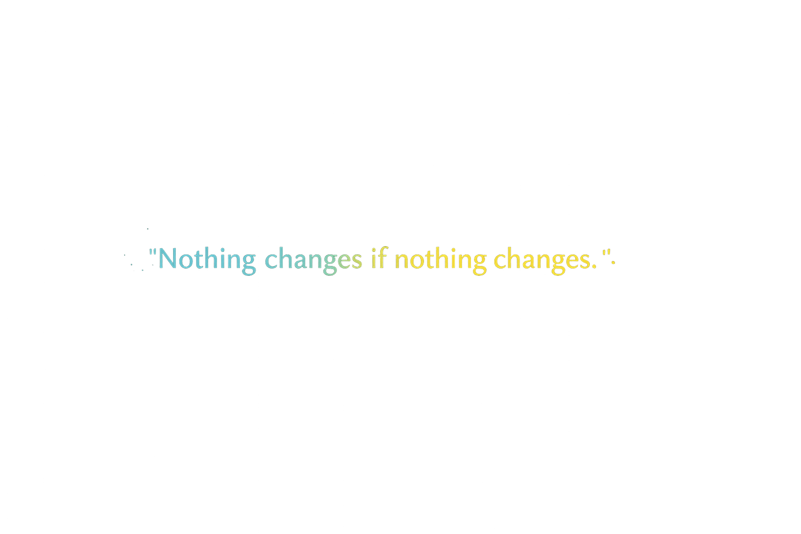

# 💫 About Me:
🧑‍💻 I'm currently working on Web development projects and small automation tools 🤝 I'm looking to collaborate on Web apps, creative tech ideas, or anything actually useful 🆘 I'm looking for help with Improving performance and writing cleaner, better code 🌱 I'm currently learning Cybersecurity, JavaScript, and software development 💬 Ask me about Web development, problem solving, or tech in general ⚡ Fun fact: I like building things that actually work, not just look good

# 💻 Tech Stack:

## 🌐 Frontend

---

## ⚙️ Backend

---

## 🗄️ Database & ORM

---

## ☁️ Cloud & Hosting

---

## ⚙️ DevOps & Tools

---

## 🎨 Design

---

## 🧠 Other / Side Stuff

---

# 📊 GitHub Stats

  
   
  
   
  

---

# 📈 Activity Graph

  

---

# 📌 Profile Summary

  

  
  

  
  

---

# 🤝 Let’s Connect

  
  
  

---

  

---
