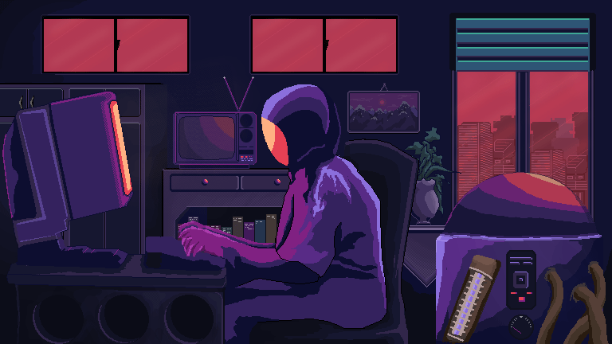

  
  

#  About Me

-  I build systems, web apps, and tools that solve real problems
-  I focus on performance, simplicity, and things that don’t break 
-  I work close to the system, servers, networking, and optimization
-  I build useful things, not just “cool projects“
-  Ask me about debugging, building, or breaking things on purpose
-  If it looks good but doesn’t work, it’s useless

<!--   -->

---

# 
  Tech Stack:

<table width="100%">
  <tr>
    <th align="left">Category</th>
    <th align="left">Technologies</th>
  </tr>
  <tr>
    <td>🌐 Frontend</td>
    <td>
      
      
      
      
      
      
      
      
       &nbsp;&nbsp;&nbsp;
    </td>
  </tr>
  <tr>
    <td>⚙️ Backend</td>
    <td>  </td>
  </tr>
  <tr>
    <td>🗄️ Database & ORM</td>
    <td> </td>
  </tr>
  <tr>
    <td>🧠 Systems & Security</td>
    <td>   </td>
  </tr>
  <tr>
    <td>☁️ Cloud & Hosting</td>
    <td> </td>
  </tr>
  <tr>
    <td>🛠️ DevOps & Tools</td>
    <td>     </td>
  </tr>
  <tr>
    <td>🎨 Design</td>
    <td> </td>
  </tr>
  <tr>
    <td>🧩 Other / Side Stuff</td>
    <td>     </td>
  </tr>
</table>

---

# 
 Coding Activity

  

<!-- 

  

---

# 📈 Activity Graph

  

 -->

<!-- ---

# 📌 Profile Summary

  

  
  

  
  

 -->

---

# 
 Let’s Connect

  

  

  

---

  

  
---

  

---
